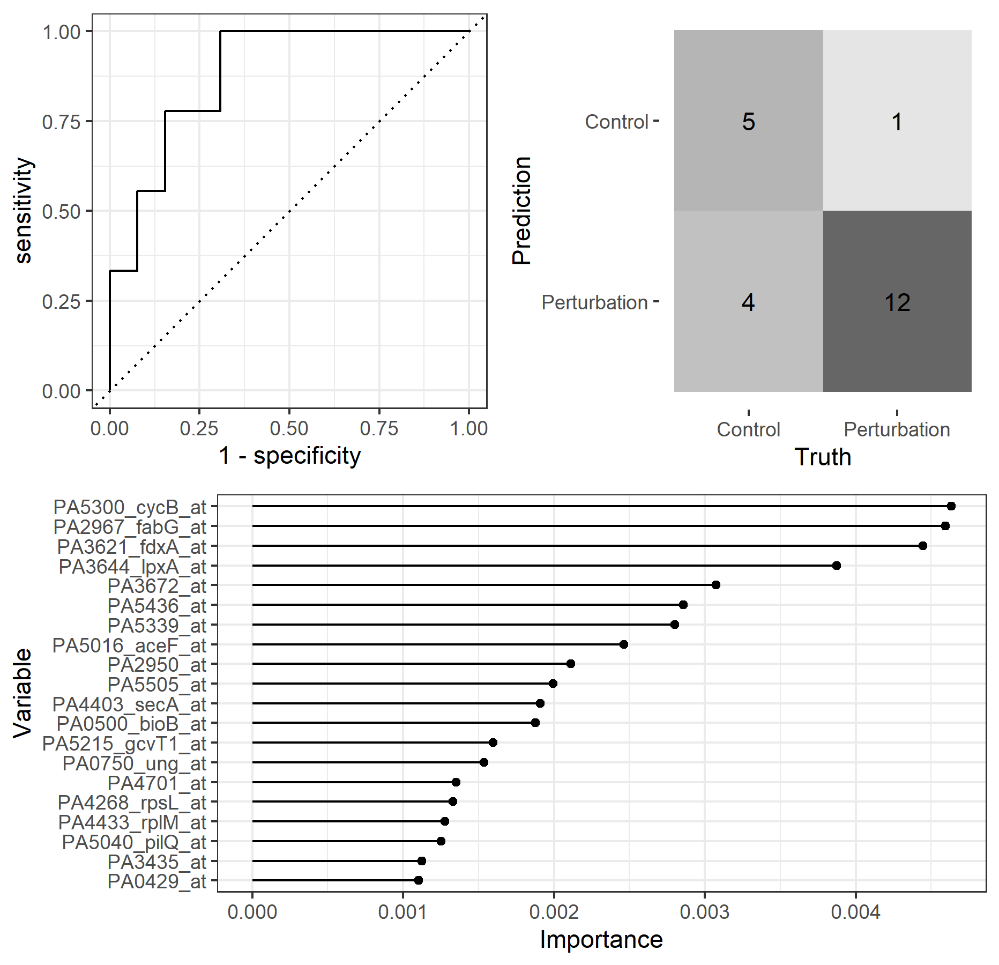

# Perturbome modeling with Tidymodels

Here I attempt to reproduce results from [A first perturbome of
_Pseudomonas aeruginosa_: Identification of core genes related to 
multiple perturbations by a machine learning 
approach](https://www.sciencedirect.com/science/article/pii/S0303264721000666?casa_token=5gk_UgzOCsUAAAAA:2ZMo4UByW6bLZpLNtN42cuE8a_KZyWsyGjnW5mqQh7SFM8vQCZIVBlJekwqbcqBsoozuzebawwLw), using  the Tidymodels 
framework instead of caret.

Original code of the paper can be found here: [Molina-Mora et al., 2021](https://github.com/josemolina6/Perturbome)

For this paper, three models were built for identification of top 
genes: a Random Forest, a Support Vector Machine and a K-nearest 
neighbor.

### Random Forest model
_Key difference_ : Here feature importance was calculated using the [vip](https://koalaverse.github.io/vip/articles/vip.html) package's permutation instead of caret::varImp. This may result in changes in
raking order.

