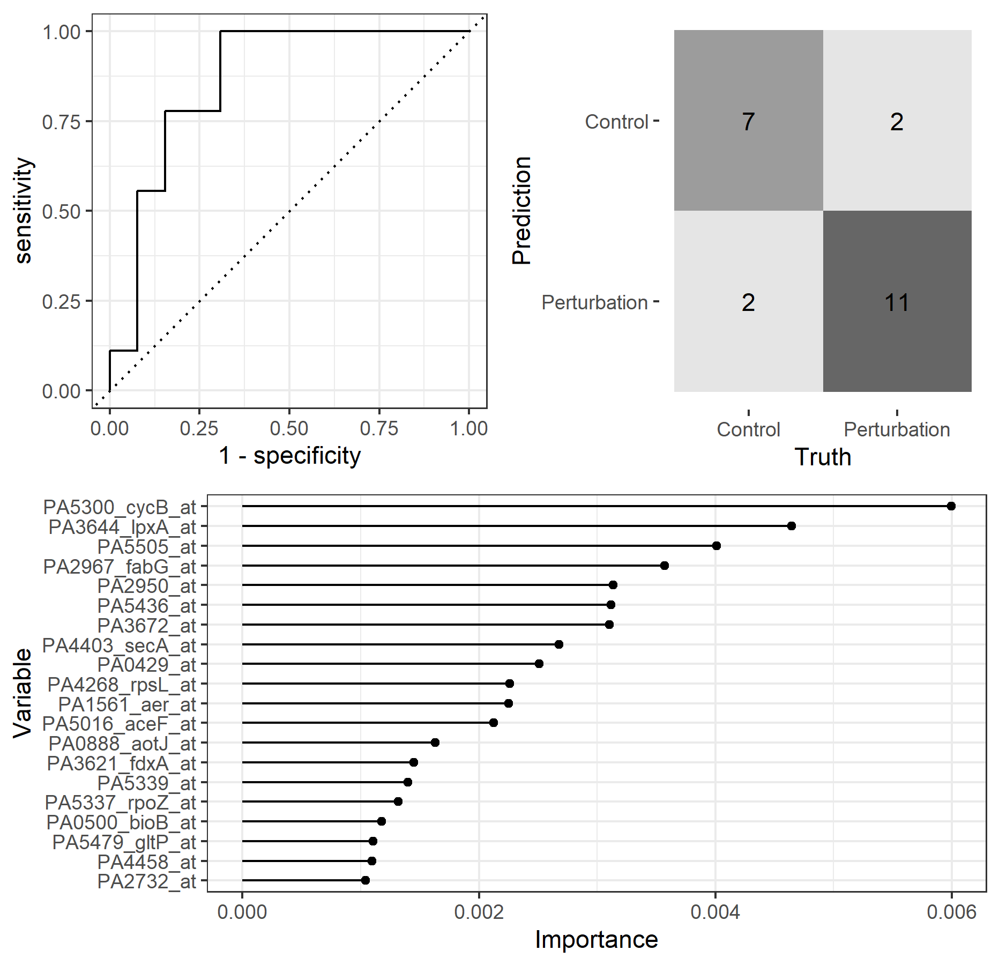

# Perturbome modeling with Tidymodels

Here I attempt to reproduce results from [A first perturbome of
_Pseudomonas aeruginosa_: Identification of core genes related to 
multiple perturbations by a machine learning 
approach](https://www.sciencedirect.com/science/article/pii/S0303264721000666?casa_token=5gk_UgzOCsUAAAAA:2ZMo4UByW6bLZpLNtN42cuE8a_KZyWsyGjnW5mqQh7SFM8vQCZIVBlJekwqbcqBsoozuzebawwLw), using  the Tidymodels 
framework instead of caret.

Original code of the paper can be found here: [Molina-Mora et al., 2021](https://github.com/josemolina6/Perturbome)

For this paper, three models were built for identification of top 
genes: a Random Forest, a Support Vector Machine and a K-nearest 
neighbor.

### About variable importance

Rather than caret::varImp, Tidymodels tipically relies on the vip
package to calculate variable importance.
[vip](https://koalaverse.github.io/vip/index.html) allows calculating model-specific feature importance, which was used for the random forest model.

For models such as the SVM and KNN [vip](https://koalaverse.github.io/vip/index.html) also allows model agnostic calculations. Here I used FIRM  based on [Greenwell et al (2018)](https://arxiv.org/abs/1805.04755).

The large number of features in this dataset may turn this calculations slow.

### Random Forest model

### Support Vector Machine model

- accuracy: 0.773
- roc_auc: 0.906
SVM seems more likely to predict "Perturbation".

### K-nearest neighbor model

- accuracy: 0.773
- roc_auc: 0.739

